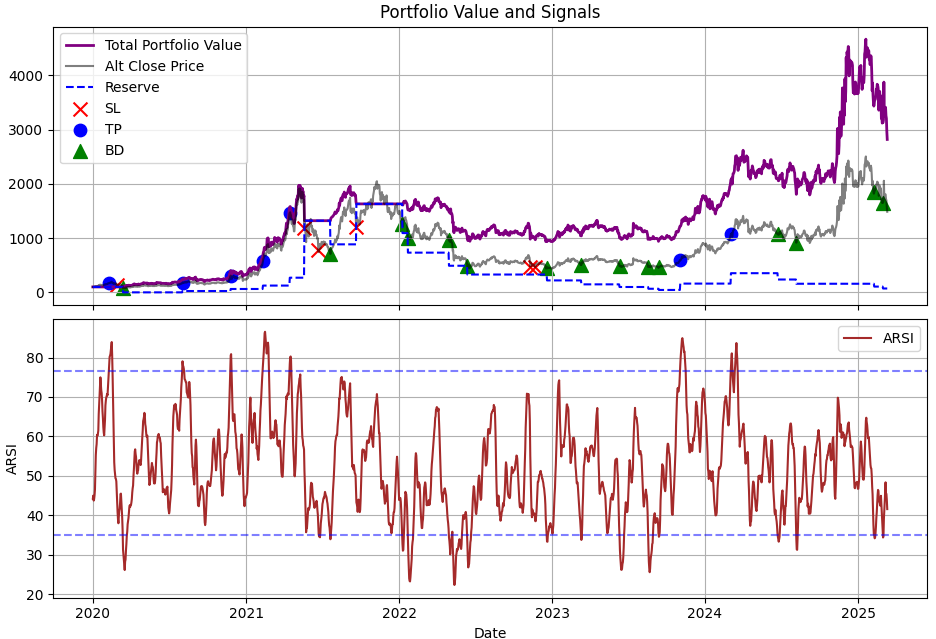
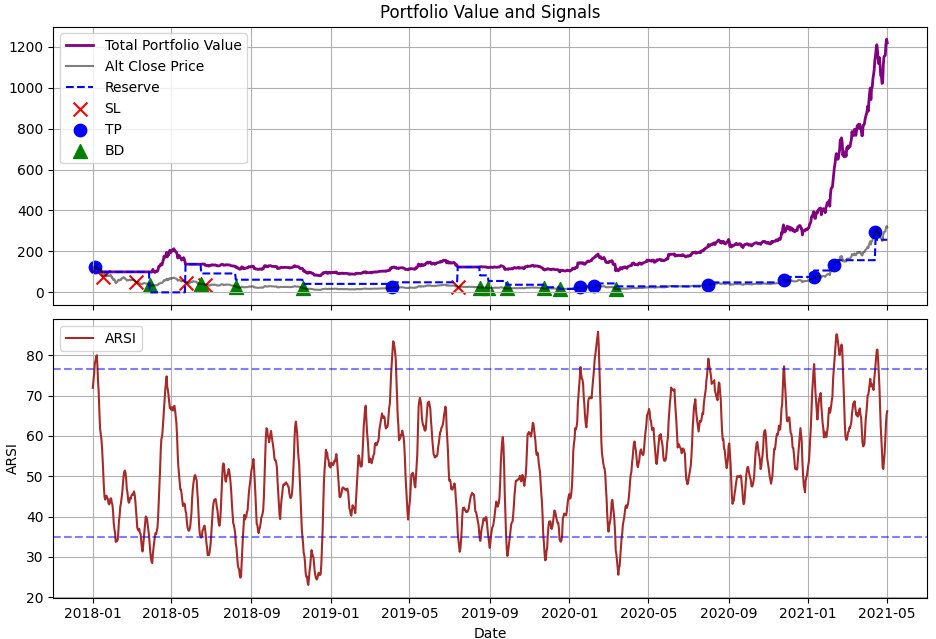

# Crypto ATF – Alt Trend Following – Automated Trading Framework

By Ramon Dev.

**ATF** stands for *alt coin trend following*. This is a work-in-progress trading algorithm bot that buys altcoins using simple rules.

## Algorithm

1. **Build ALT index** composed of the top 10 altcoins, excluding ETH and stablecoins (using the `AltIndex` class).
2. **Coingecko** is used to get market caps of top 250 coins. We assume the top 10 coins in 2018 remain in today's top 250. (see `coingecko` class)
3. **Monthly rebalancing**: `AltIndex` keeps the top 10 coins for one month, then on the 1st day of each month, it re-checks the new top 10.
4. **Binance API** fetches historical price data for the top 250 coins.
5. **Compute RSI and ARSI** (a 5-day moving average of RSI). (see `Stock` class)
6. **Initial funding** is set in `ConfigATF`.
7. **BD (Buy the Dip) signal** invests `buy_dip.dip_share`% of cash into the top 10.
8. **SL (Stop Loss) signal** sells all coins.
9. **TP (Take Profit) signal** sells `sell_tp.tp_share`% of coins.
10. **BD signal occurs** if `buy_dip.rsi_min_thresh < ARSI < buy_dip.rsi_max_thresh`.
11. **SL signal** occurs if the alt index drops `sl_share`% within a `win_sl` day window, but only if `ARSI > sell_sl.rsi_min_thresh` to avoid selling too low.
12. **TP signal** occurs if `ARSI > sell_tp.rsi_min_thresh`.
13. **No selling at a loss**: if we bought at a higher price, sell signals are ignored.

## Simulation

Below is how the portfolio evolves in comparison to the index (our strategy vs. a simple buy-and-hold):

